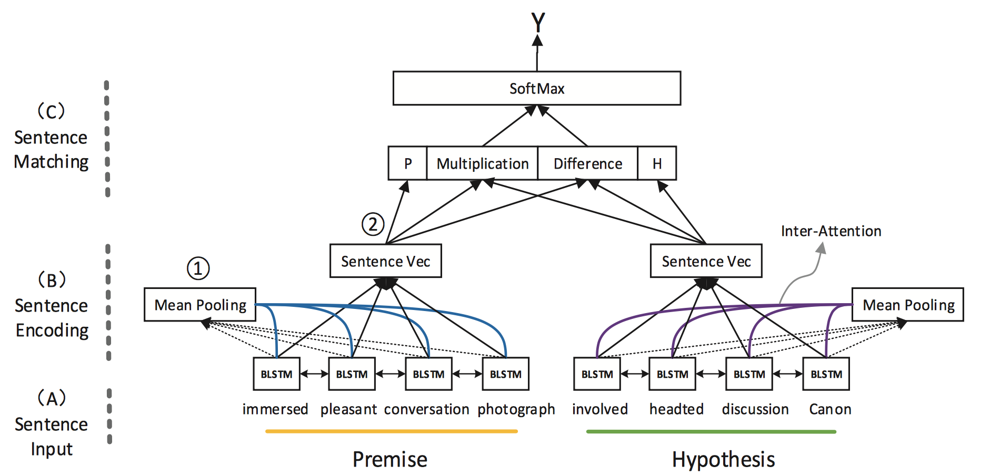
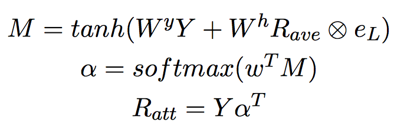
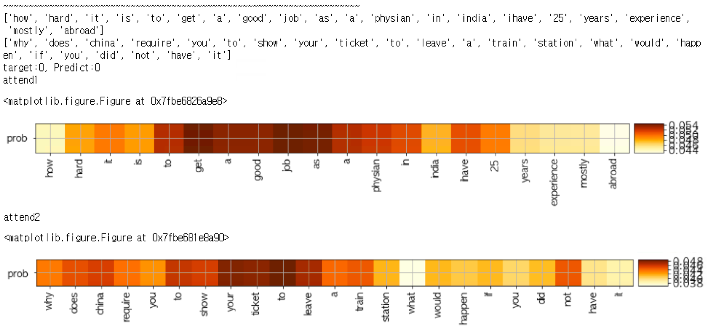
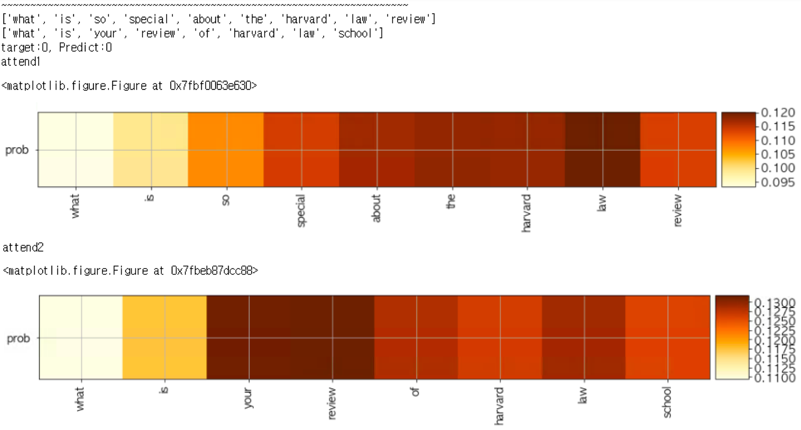
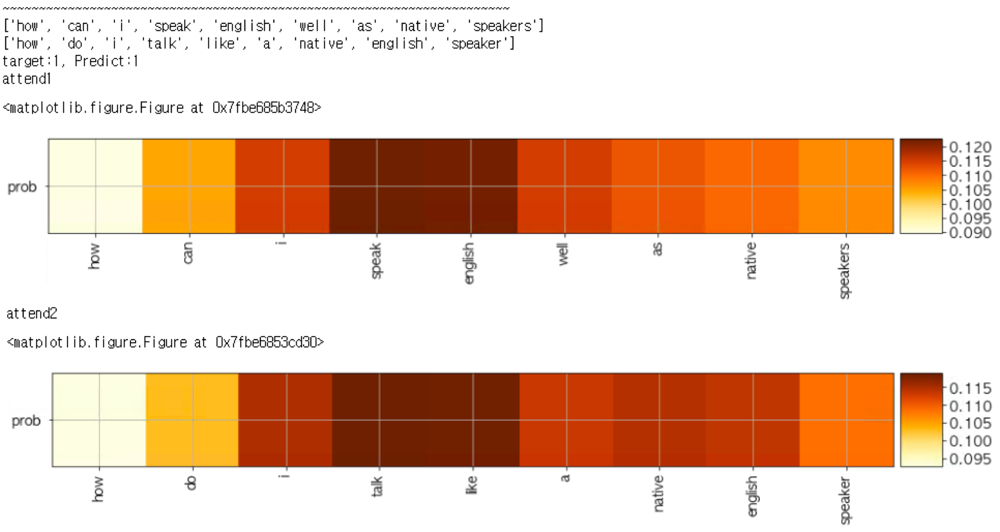
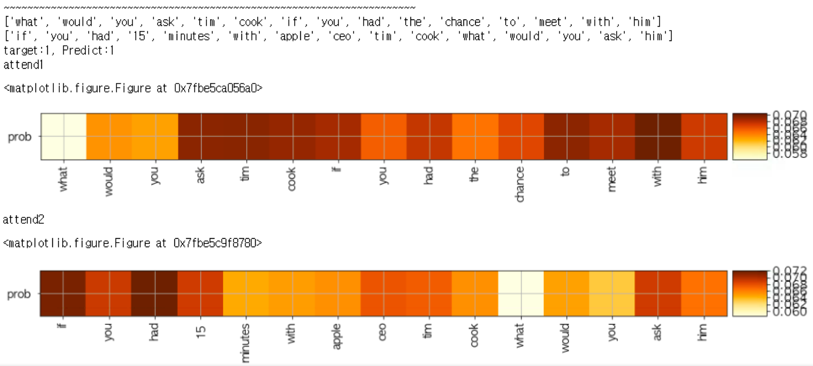

# Implementation of sentence comparison model using inner attention  
  
#### cuteboydot@gmail.com    
  
#### reference  
1. [Learning Natural Language Inference using Bidirectional LSTM model and Inner-Attention, Y Liu](https://arxiv.org/pdf/1605.09090.pdf)  
  
#### data reference  
1. [qoura question pair dataset](https://data.quora.com/First-Quora-Dataset-Release-Question-Pairs)  
  
### 1. Inner attention for sentence comparison.  
논문에서는 SNLI 데이터를 사용하여 두문장의 관계(Contrast, Entailment, Neutral)를 찾지만,  
본 코드에서는 Quora의 두 질문이 동일한 내용인가 판별하는 모델을 기준으로 작성하였다.  
  
  
  
위 그림은 전체적인 구조를 보여주는데, 두 문장을 비교 하기 위해 biRNN과 Attention을 사용한다.  
Attention를 구하기 위해 biRNN의 출력 행렬 Y와 mean pooling vector인 R_ave를 함께 사용한다.  
  
  
  
### 2. Test result   
       
       
       
       